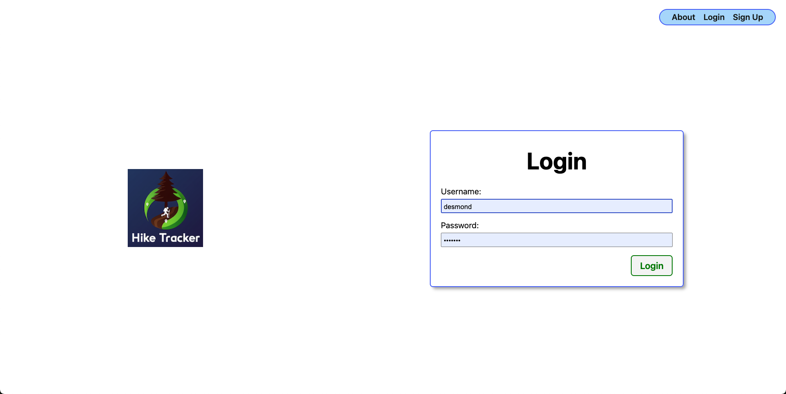

# Hike Tracker
I decided to make an app that tracks hikes after going on a hike I've already been on few weeks back and wanting to remember if it was that hard the last time or if I'm just out of shape.

## Getting started
You can find the [deployed site here](https://hiketracker-cea4b077c977.herokuapp.com/)

My planning materials [can be found here](https://trello.com/b/fwds0WiU/django-hike-tracker)

## Attributions
### Online documentation
 - I used websites like [MDN](https://developer.mozilla.org/en-US/) and [W3] (https://www.w3schools.com/) throughout our project whenever we got stuck.
### Class notes and labs
 -  I used class notes like the [Django CRUD App - Cat Collector](https://generalassembly.instructure.com/courses/702/pages/django-crud-app-cat-collector?module_item_id=60461) to help build the site and the [Django Deployment Guide](https://pages.git.generalassemb.ly/modular-curriculum-all-courses/universal-resources/deployment/django-deployment/) for guidance on deploying my app to Heroku

## Technologies Used: 
1. **Python**
2. **CSS**
3. **HTML**
4. **postgresql**

## Next steps
There were quite a few things I wanted to include in my site but I was unable to due to time limitations and my current skill level 

1. **Allow users to upload photos**
* Having the ability to upload photos for hikes would be great for user's to have all their photos in one place.
2. **View and select from a database of hikes if your hike already exists**
* It'd be great to have had a social aspect to the site where users can select the hike they went on and have their posts live in the same place as other users.
3. **Categorize hikes as complete or add them to a wishlist**
* Categorization would be helpful for users to keep better track of their hikes and would greatly improve the usefulness of my site.